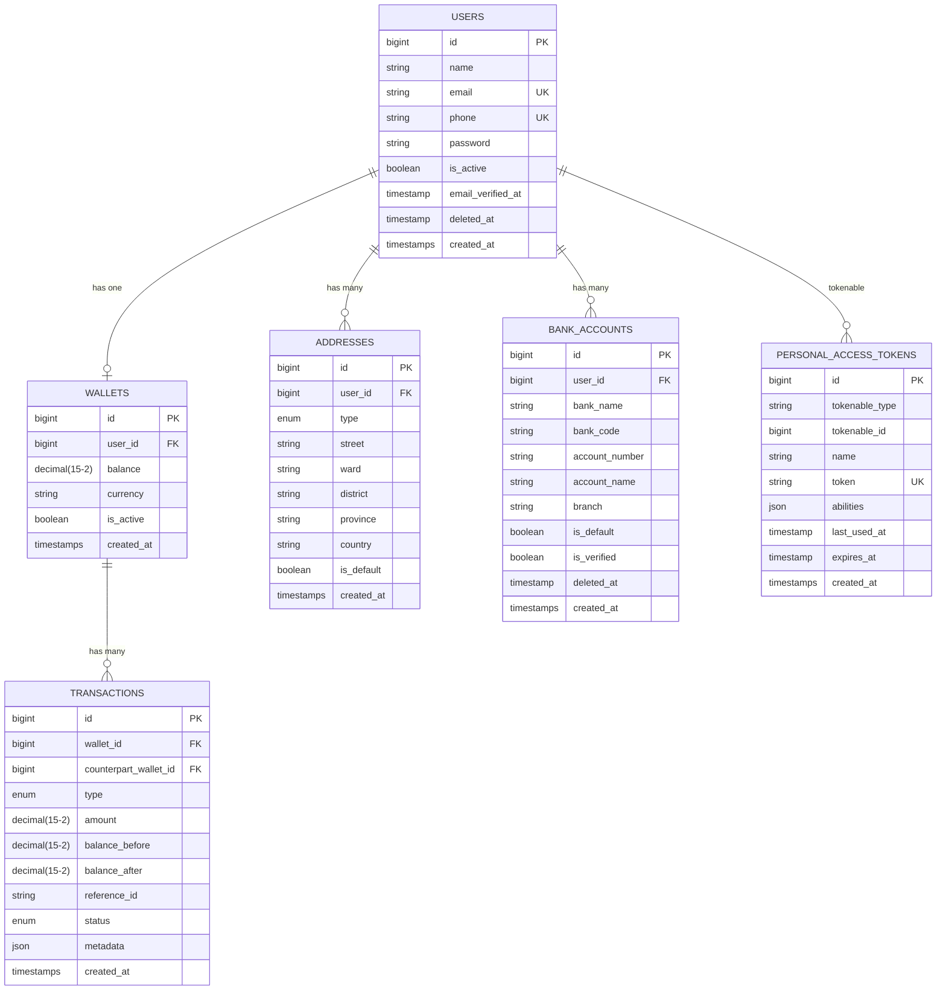

# E-Wallet API

<div align="center">


**Production-grade REST API Ví Điện Tử xây dựng bằng Laravel 11**

*Tập trung vào: Service-Repository Pattern · Pessimistic Locking · Race Condition Prevention · Financial Precision với BCMath*

</div>

---

## Mục Lục

- [Tính Năng Nổi Bật](#-tính-năng-nổi-bật)
- [Tech Stack](#-tech-stack)
- [Kiến Trúc Hệ Thống](#-kiến-trúc-hệ-thống)
- [ER Diagram](#-er-diagram)
- [API Endpoints](#-api-endpoints)
- [Cài Đặt & Khởi Chạy](#-cài-đặt--khởi-chạy)
- [Swagger UI](#-swagger-ui)
- [Kiểm Thử](#-kiểm-thử)
- [Artisan Commands](#-artisan-commands)
- [Cấu Trúc Thư Mục](#-cấu-trúc-thư-mục)

---

## Tính Năng Nổi Bật

| Tính Năng | Mô Tả |
|---|---|
|  **Sanctum Auth** | Token-based authentication với RateLimiter chặn brute-force (lockout sau 5 lần sai) |
|  **BCMath Precision** | Tính toán số dư tài chính `DECIMAL(15,2)` qua BCMath, loại bỏ sai số float |
|  **Pessimistic Locking** | `SELECT ... FOR UPDATE` ngăn chặn Race Condition khi nhiều tiến trình ghi đồng thời |
|  **Anti-Deadlock** | Lock các ví theo thứ tự ID tăng dần trong `TransferService`, triệt tiêu deadlock chéo |
|  **Webhook HMAC-SHA256** | Xác thực chữ ký số mỗi webhook nạp tiền từ cổng thanh toán |
|  **Audit Command** | `wallet:audit` đối soát số dư ví với Eloquent Chunking (không tốn RAM) |
|  **JSON Logging** | Channel `transactions` ghi log tài chính dạng JSON chuẩn cho ETL/monitoring |
|  **Swagger OpenAPI 3.0** | Tài liệu API tự động sinh từ PHP 8 Attributes annotations |

---

##  Tech Stack

- **Framework**: Laravel 12.x · PHP 8.2 (`strict_types=1` toàn hệ thống)
- **Database**: MySQL 8 — schema `DECIMAL(15,2)` cho tất cả trường tiền tệ
- **Cache / Queue**: Redis (Rate Limiting, Queue Jobs)
- **Auth**: Laravel Sanctum — API Tokens
- **API Docs**: `darkaonline/l5-swagger` · OpenAPI 3.0 PHP 8 Attributes
- **Testing**: PHPUnit — Feature Tests với SQLite in-memory

---

##  Kiến Trúc Hệ Thống

### Request Pipeline

```
Client
  │
  ▼
Middleware Layer
├── Sanctum (auth:sanctum)
├── RateLimiter (Login Throttle)
└── VerifyWebhookSignature (HMAC-SHA256)
  │
  ▼
Form Request (Validation Layer)
├── RegisterRequest / LoginRequest
├── DepositRequest
└── TransferRequest
  │
  ▼
Controller (Routing Only)
  │
  ▼
Service Layer (Business Logic)
├── AuthService       → register() | login()
├── DepositService    → deposit() + verifyChecksum()
└── TransferService   → transfer() + anti-deadlock ordering
  │
  ▼
Repository Layer (Data Access)
├── WalletRepository       → find() | findForUpdate() | credit() | debit()
└── TransactionRepository  → createDeposit() | createTransferPair()
  │
  ▼
Database (MySQL)
└── DB::transaction() + lockForUpdate()
```

### Luồng Chuyển Tiền (Anti-Deadlock)

```
TransferService::transfer(senderId=3, receiverId=1)
  │
  ├── Sắp xếp lock theo ID tăng dần: [1, 3]
  ├── lockForUpdate(walletId=1) ← khóa ví 1 trước
  ├── lockForUpdate(walletId=3) ← khóa ví 3 sau
  │
  ├── WalletRepo::debit(wallet_3, amount)   → InsufficientBalanceException nếu <0
  ├── WalletRepo::credit(wallet_1, amount)
  ├── TransactionRepo::createTransferPair() → 2 records, cùng reference_id (UUID)
  │
  └── DB::transaction COMMIT / ROLLBACK
```

---

##  ER Diagram



### Ghi Chú Thiết Kế DB

| Quyết Định | Lý Do |
|---|---|
| `DECIMAL(15, 2)` cho `balance`, `amount` | Tránh sai số khi cộng/trừ số thực (float/double) |
| `balance_before` & `balance_after` trong `transactions` | Phục vụ audit trail, không cần reconstruct lịch sử |
| `reference_id` UUID chung cho 2 records transfer | Liên kết transfer_out ↔ transfer_in thành cặp đồng bộ |
| `softDeletes` cho `users`, `bank_accounts` | Không xóa cứng dữ liệu tài chính |
| `counterpart_wallet_id` trong transactions | Biết ngay đối tác giao dịch mà không cần join phức tạp |

---

## API Endpoints

### Authentication

| Method | Endpoint | Mô Tả | Auth |
|---|---|---|---|
| `POST` | `/api/v1/auth/register` | Đăng ký — tự tạo ví số dư 0 | ❌ |
| `POST` | `/api/v1/auth/login` | Đăng nhập lấy Sanctum token (giới hạn 5 lần sai) | ❌ |
| `POST` | `/api/v1/auth/logout` | Hủy token hiện tại | ✅ |

### Wallet

| Method | Endpoint | Mô Tả | Auth |
|---|---|---|---|
| `GET` | `/api/v1/wallet/balance` | Xem số dư ví | ✅ |
| `POST` | `/api/v1/wallet/deposit` | Webhook nhận nạp tiền (kèm HMAC signature) | Signature |
| `POST` | `/api/v1/wallet/transfer` | Chuyển tiền đến ví khác | ✅ |

### Addresses

| Method | Endpoint | Mô Tả | Auth |
|---|---|---|---|
| `GET` | `/api/v1/addresses` | Danh sách địa chỉ | ✅ |
| `POST` | `/api/v1/addresses` | Thêm địa chỉ mới | ✅ |
| `PUT` | `/api/v1/addresses/{id}` | Cập nhật địa chỉ | ✅ |
| `DELETE` | `/api/v1/addresses/{id}` | Xóa địa chỉ | ✅ |

### Bank Accounts

| Method | Endpoint | Mô Tả | Auth |
|---|---|---|---|
| `GET` | `/api/v1/bank-accounts` | Danh sách tài khoản ngân hàng liên kết | ✅ |
| `POST` | `/api/v1/bank-accounts` | Liên kết ngân hàng mới | ✅ |
| `DELETE` | `/api/v1/bank-accounts/{id}` | Gỡ liên kết ngân hàng | ✅ |

### Response Format Chuẩn

```json
{
  "status": "success | error",
  "message": "Mô tả trạng thái",
  "data": { },
  "errors": { }
}
```

---

##  Cài Đặt & Khởi Chạy

### Yêu Cầu Hệ Thống

- PHP >= 8.2
- MySQL >= 8.0
- Redis (optional — dùng cho Rate Limiting & Queue)
- Composer

### Bước 1: Clone & Cài Dependencies

```bash
git clone https://github.com/<username>/e-wallet-api.git
cd e-wallet-api
composer install
```

### Bước 2: Cấu Hình Môi Trường

```bash
cp .env.example .env
php artisan key:generate
```

Chỉnh sửa file `.env`:

```ini
DB_CONNECTION=mysql
DB_HOST=127.0.0.1
DB_PORT=3306
DB_DATABASE=ewallet
DB_USERNAME=root
DB_PASSWORD=

# Quan trọng: Key bí mật dùng để verify HMAC-SHA256 webhook nạp tiền
WALLET_CHECKSUM_SECRET=your-super-secret-hmac-key-change-in-production

# Giới hạn số tiền chuyển tối đa mỗi giao dịch
WALLET_MAX_TRANSFER=50000000.00

# Tự sinh lại Swagger docs mỗi request (chỉ dùng khi dev)
L5_SWAGGER_GENERATE_ALWAYS=true
L5_SWAGGER_CONST_HOST=http://127.0.0.1:8000
```

### Bước 3: Chạy Database Migration

```bash
php artisan migrate
```

### Bước 4: Khởi Chạy Server

```bash
php artisan serve
```

Server chạy tại: `http://127.0.0.1:8000`

---

## Swagger UI

Truy cập tài liệu API tương tác:

```
http://127.0.0.1:8000/api/documentation
```

**Hướng dẫn dùng Swagger UI:**
1. Gọi **POST** `/api/v1/auth/register` để tạo tài khoản.
2. Gọi **POST** `/api/v1/auth/login` — copy token trả về.
3. Click nút **Authorize 🔓** ở góc trên phải → nhập `Bearer <token>`.
4. Thực hiện gọi các API Wallet, Address, Bank Account.

**Generate lại tài liệu thủ công:**

```bash
php artisan l5-swagger:generate
```

---

## Kiểm Thử

Chạy toàn bộ test suite (dùng SQLite in-memory, không cần MySQL):

```bash
php artisan test
```

### Kết Quả Mong Đợi

```
   PASS  Tests\Unit\ExampleTest
   PASS  Tests\Feature\AuthTest
  ✓ register creates user and wallet successfully
  ✓ login returns token successfully
  ✓ login lockout after five failed attempts

   PASS  Tests\Feature\DepositTest
  ✓ deposit with valid checksum success
  ✓ deposit with invalid checksum fails 400

   PASS  Tests\Feature\TransferTest
  ✓ transfer success
  ✓ transfer fails when insufficient balance
  ✓ transfer fails when limit exceeded
  ✓ pessimistic locking prevents race condition

  Tests: 11 passed (54 assertions)
  Duration: ~0.6s
```

### Mô Tả Các Test Case Quan Trọng

| Test | Kịch Bản |
|---|---|
| `register_creates_user_and_wallet` | Đăng ký tự động tạo ví `balance=0.00 VND` trong cùng 1 DB transaction |
| `login_lockout_after_five_attempts` | RateLimiter trả 422 từ lần cố thứ 6 trở đi, kèm thời gian chờ |
| `deposit_with_valid_checksum` | Webhook HMAC đúng → credit ví, ghi transaction với balance_before/after |
| `deposit_with_invalid_checksum` | Signature sai → 400, số dư không thay đổi |
| `transfer_success` | Hai ví cập nhật chính xác, sinh 2 records cùng reference_id UUID |
| `pessimistic_locking_race_condition` | Debit ví về 0 → lần tiếp theo throw `InsufficientBalanceException` |

---

## Artisan Commands

### Đối Soát Số Dư (`wallet:audit`)

So sánh số dư thực tế trong bảng `wallets` với tổng giao dịch lịch sử:

```bash
php artisan wallet:audit
```

**Output khi không lệch:**
```
Bắt đầu quy trình đối soát số dư ví điện tử...
Đã hoàn tất đối soát 1000 ví.
Thành công: Toàn bộ số dư của các ví trùng khớp hoàn hảo với doanh số lịch sử.
```

**Output khi phát hiện bất thường:**
```
CẢNH BÁO: Phát hiện 2 tài khoản bị lệch số dư!

 ─────────────────────────────────────────────────────────────
  Wallet ID | User ID | Số dư Ví  | Tổng GD thực tế | Lệch
 ─────────────────────────────────────────────────────────────
  12        | 5       | 100000.00 | 95000.00        | 5000.00
 ─────────────────────────────────────────────────────────────
```

Đồng thời ghi log vào `storage/logs/transactions.log` (JSON format) để ETL pipeline xử lý.

---

## Cấu Trúc Thư Mục

```
app/
├── Console/Commands/
│   └── WalletAuditCommand.php      # Artisan: wallet:audit
├── Exceptions/
│   ├── InsufficientBalanceException.php
│   └── InvalidChecksumException.php
├── Http/
│   ├── Controllers/Api/
│   │   ├── AuthController.php      # register, login, logout
│   │   ├── WalletController.php    # balance, deposit, transfer
│   │   ├── AddressController.php   # CRUD địa chỉ
│   │   └── BankAccountController.php # CRUD ngân hàng liên kết
│   ├── Middleware/
│   │   └── VerifyWebhookSignature.php  # HMAC-SHA256 checker
│   └── Requests/
│       ├── Auth/RegisterRequest.php
│       ├── Auth/LoginRequest.php
│       ├── Wallet/DepositRequest.php
│       └── Wallet/TransferRequest.php
├── Models/
│   ├── User.php · Wallet.php · Transaction.php
│   ├── Address.php · BankAccount.php
├── Repositories/
│   ├── Contracts/
│   │   ├── WalletRepositoryInterface.php
│   │   └── TransactionRepositoryInterface.php
│   ├── WalletRepository.php        # findForUpdate(), credit(), debit()
│   └── TransactionRepository.php   # createDeposit(), createTransferPair()
└── Services/
    ├── AuthService.php             # register() + login() với RateLimiter
    ├── DepositService.php          # deposit() + verifyChecksum()
    └── TransferService.php         # transfer() + deadlock prevention

database/migrations/               # Schema hoàn chỉnh cho toàn bộ 5 bảng
config/wallet.php                   # max_transfer, checksum_secret, login limits
routes/api.php                      # API routes prefix /api/v1/
tests/Feature/
    ├── AuthTest.php
    ├── DepositTest.php
    └── TransferTest.php
```

---

## Bảo Mật

- **SQL Injection**: Eloquent ORM + PDO Prepared Statements.
- **Brute-force Login**: Laravel `RateLimiter` — lockout 15 phút sau 5 lần sai.
- **Webhook Tampering**: HMAC-SHA256 `hash_equals()` chống timing attack.
- **Race Condition**: Pessimistic Locking `lockForUpdate()` trong DB Transaction.
- **Sensitive Data**: Password hash bằng `bcrypt`, token Sanctum không lưu plaintext.
- **Soft Delete**: Dữ liệu users, bank_accounts không bao giờ bị xóa cứng.

---
## Liên hệ

Email: vyquy633@gmail.com
